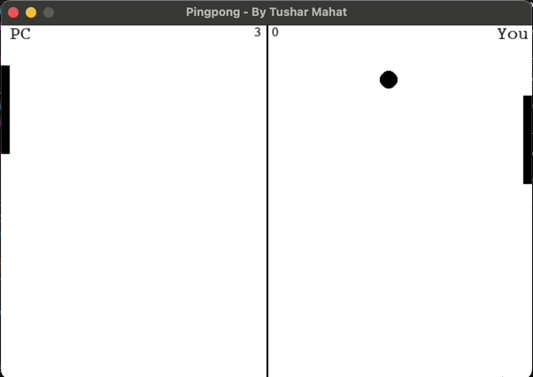

# Pingpong Game

This is a simple Pingpong game implemented in Python using the Pygame library. The game features a player-controlled paddle and an AI-controlled paddle, with the goal of hitting the ball back and forth without missing it. The first player to reach a score of 5 wins the game.



## Game Controls

- Press `Space` to start or restart the game.
- Use `Up` and `Down` arrow keys to move the player-controlled paddle up and down.

## How to Run the Game

1. Install Python if you haven't already. You can download it from the [official Python website](https://www.python.org/downloads/).
2. Install Pygame library using pip:
   ```
   pip install pygame
   ```
3. Clone or download this repository to your local machine.
4. Navigate to the directory containing the game files in your terminal or command prompt.
5. Run the game by executing the following command:
   ```
   python pingpong.py
   ```

## Game Features

- Real-time ball and paddle physics simulation.
- Score tracking for both the player and the AI.
- Game over popup when either player reaches a score of 5.

## Play Again

After each game, you will be prompted to play again. Press `Y` to play again or `N` to exit the game.

## Author

This game is created by Tushar Mahat.

Feel free to contribute to the project by submitting pull requests or reporting any issues you encounter while playing the game.

Have fun playing Pingpong!
